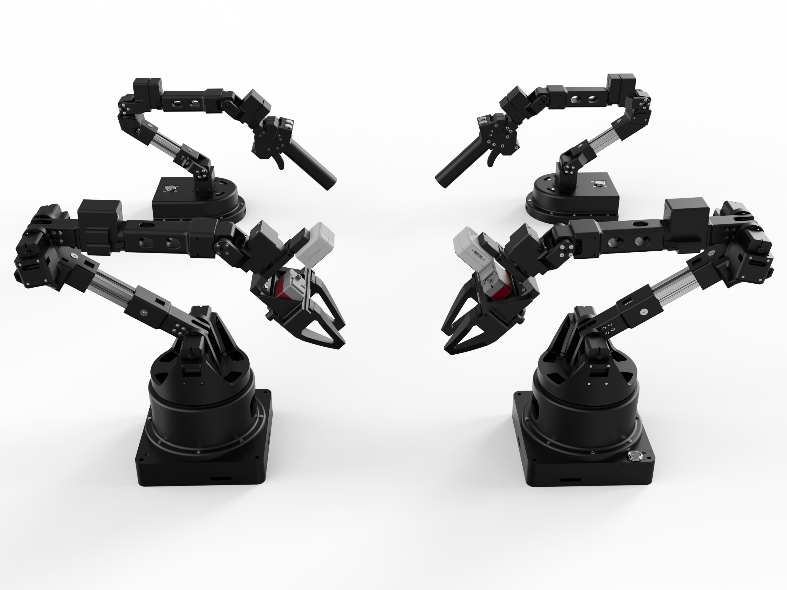

# Alicia-D Series Robotic Arm by Synria Robotics

[English Version](README.md) | [中文版](README_CH.md) | [Official Taobao Store](https://g84gtpygdv6trpvdhcsy0kfr73avcip.taobao.com/shop/view_shop.htm?appUid=RAzN8HWKU5B7MfX6JjEWgkuNfftNVbnrjbjx6fPjY9KqXB46Rvy&spm=a21n57.1.hoverItem.2) | [Alicia-D Product Manual (CN)](https://tcnqzgyay0jb.feishu.cn/wiki/ElDUwERlNilPLWkJ2e2cYGyZncb?fromScene=spaceOverview)



## Overview
The Alicia-D series by Synria Robotics provides a cost-effective, fully functional platform for teleoperation data collection and reproducing state-of-the-art robotic algorithms such as imitation learning (IL), reinforcement learning (RL), and vision-language-action (VLA).
This repository provides ROS 1 code and examples for the single-arm manipulator of the Alicia-D series.

## Recommended System

- Ubuntu 20.04
- ROS Noetic

## Installation

Run the install script (it installs required dependencies and builds the workspace):

```bash
mkdir -p alicia_ws/src
cd alicia_ws
git clone https://github.com/Synria-Robotics/Alicia-D-ROS1.git -b v5.5.0 ./src/
./src/install/alicia_amd64_install.sh
```

## Repository Structure
This repository contains several directories, each including ROS packages and resources related to the Alicia-D robotic arm series:

```
├── alicia_d_calibration
├── alicia_d_descriptions
├── alicia_d_driver
├── alicia_d_moveit
├── alicia_d_object_sort
```

### Core ROS Packages

- `alicia_d_calibration`: Tools for hand-eye calibration and related procedures
- `alicia_d_descriptions`: URDF and mesh files for visualization in RViz
- `alicia_d_driver`: Low-level control and communication with the robot arm
- `alicia_d_moveit`: MoveIt configuration for motion planning and control

### Functional Packages and Demos

- `alicia_d_object_sort`: Multi-color cube sorting demo

## Usage

- Set serial port permission

```
sudo usermod -a -G dialout $USER
# log out after setting

# temporarily setting
sudo chmod 666 /dev/ttyUSB*
```
- Check the hardware connection
```
ls -l /dev/ttyUSB*
```


- Start the Alicia-D driver only:

```bash
roslaunch alicia_d_driver alicia_d_driver.launch
```

- Start the Alicia-D driver with MoveIt:

```bash
roslaunch alicia_d_driver alicia_d_bringup.launch
```


- USB camera calibration:

    Refer [Alicia-D calibration guide](alicia_d_calibration/README.md)

- Cube Sorting:

    Refer [Alicia-D object sorting guide](alicia_d_object_sort/README.md)

## **Links**

- **Official Taobao Store**: [Alicia-D by Synria Robotics on Taobao](https://g84gtpygdv6trpvdhcsy0kfr73avcip.taobao.com/shop/view_shop.htm?appUid=RAzN8HWKU5B7MfX6JjEWgkuNfftNVbnrjbjx6fPjY9KqXB46Rvy&spm=a21n57.1.hoverItem.2)
- **Product Manual**: [Alicia-D Product Manual (Chinese)](https://tcnqzgyay0jb.feishu.cn/wiki/ElDUwERlNilPLWkJ2e2cYGyZncb?fromScene=spaceOverview)
